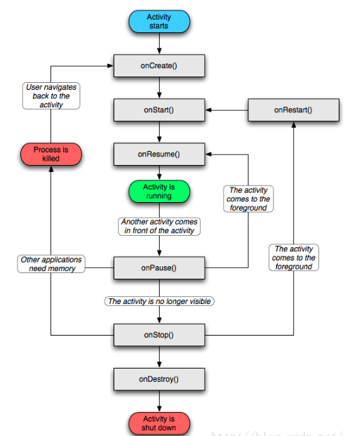
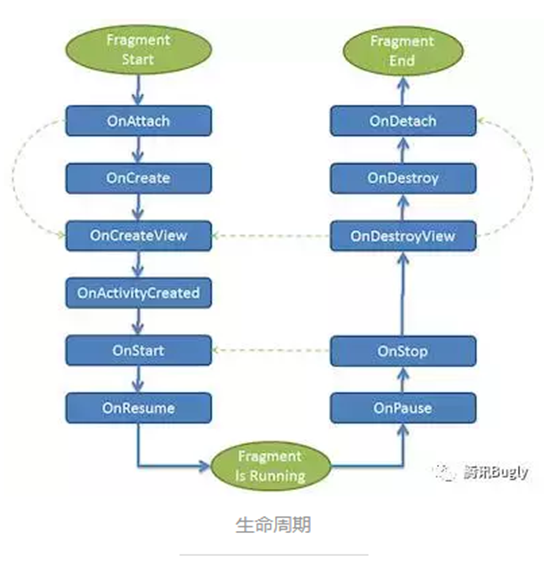

# Android笔记

​				——主窗体与碎片

#### 主窗体与碎片：Activity and Fragment

##### Activity:主窗体

###### 生命周期：

|    方法     |                             说明                             |
| :---------: | :----------------------------------------------------------: |
| onCreate()  |         在Activity被创建时回调，开启Activity的第一步         |
|  onStart()  | Activity正在启动，此时Activity已处于可见状态，只是还没有在前台显示，因此无法与用户进行交互 |
| onResume()  |             Activity已在前台可见，可与用户交互了             |
|  onPause()  |                       Activity正在停止                       |
|  onStop()   |               此时Activity不可见，仅在后台运行               |
| onRestart() | Activity由不可见变为可见状态时，一般为退出主页面又返回时触发 |
| onDestroy() | Activity正在被销毁，也是生命周期最后一个执行的方法，在此方法中做一些回收工作和最终的资源释放 |

###### 开启主窗体：

```java
<activity android:name=".Load.Main19Activity" android:launchMode="standard">
            <intent-filter>
                <action android:name="android.intent.action.MAIN" />

                <category android:name="android.intent.category.LAUNCHER" />
            </intent-filter>
        </activity>
```

1. ​	android.intent.action.MAIN决定应用程序最先启动的Activity

2. ​	android.intent.category.LAUNCHER决定应用程序是否显示在程序列表里

3. ​	android:launchMode="standard"加载模式（4种）

   |         加载模式          |                             说明                             |
   | :-----------------------: | :----------------------------------------------------------: |
   |     Standard 标准模式     | 每次启动一个Activity都会又一次创建一个新的实例入栈，无论这个实例是否存在 |
   |  SingleTop 栈顶复用模式   | 要创建的Activity已经处于栈顶时，会直接复用栈顶的Activity；若要创建的Activity不处于栈顶，会创建一个新的Activity入栈 |
   |  SingleTask 栈内复用模式  | 创建的Activity已经处于栈中时，不会创建新的Activity，而是将存在栈中的Activity上面的其他Activity所有销毁，使它成为栈顶 |
   | SingleInstance 单实例模式 |          此模式的Activity仅仅能单独位于一个任务栈中          |

##### Fragment:碎片

###### 生命周期：

|        方法         |                             说明                             |
| :-----------------: | :----------------------------------------------------------: |
|     onAttach()      |                  Fragment已经关联到activity                  |
|     onCreate()      |                       创建fragment对象                       |
|   onCreateView()    |                       fragment创建布局                       |
| onActivityCreated() | 初始化那些需要父Activity或者Fragment的UI已经被完整初始化才能初始化的元素 |
|      onStart()      | fragment正在启动，此时fragment已处于可见状态，只是还没有在前台显示，因此无法与用户进行交互 |
|     onResume()      |             fragment已在前台可见，可与用户交互了             |
|      onPause()      |                       fragment正在停止                       |
|      onStop()       |               此时fragment不可见，仅在后台运行               |
|   onDestroyView()   |                       fragment移除布局                       |
|     onDestroy()     |                       销毁fragment对象                       |
|     onDetach()      |                  Fragment和Activity解除关联                  |

###### 特点：

1. Fragment是依赖于Activity的，不能独立存在的。

2. 一个Activity里可以有多个Fragment。

3. 一个Fragment可以被多个Activity重用。

4. Fragment有自己的生命周期。

5. 能在Activity运行时动态地添加或删除Fragment。

   

###### 碎片的创建：

1. 新建一个class文件继承Fragment

2. 重写onCreateView方法返回一个view

   ```java
   public class Fragment  extends Fragment {
       @Nullable
       @Override
       public View onCreateView(@NonNull LayoutInflater inflater, @Nullable ViewGroup container, @Nullable Bundle savedInstanceState) {
           return inflater.inflate(R.layout.fm1,null);
       }
   }
   ```

3. 新建的layout文件若不存在，alt+enter快速建立layout文件（create layout view resource 'fm1‘）

###### 碎片的加载：

1. 静态加载：静态加载就是把Fragment当成普通的控件，直接写在Activity的布局文件中

   ```java
   <?xml version="1.0" encoding="utf-8"?>
   <LinearLayout xmlns:android="http://schemas.android.com/apk/res/android"
       android:layout_width="match_parent"
       android:layout_height="match_parent"
       android:background="#fff">
   
       <fragment
           android:name="Fragment"
           android:layout_width="match_parent"
           android:layout_height="match_parent" />
   
   </LinearLayout>
   ```

   

2. 动态加载:碎片的动态加载就是在app运行时根据需要加载相应的Fragment显示

   ```java
   	@Override
       protected void onCreate(Bundle savedInstanceState) {
           super.onCreate(savedInstanceState);
           setContentView(R.layout.activity_main1);
   
           //获取辅助碎片管理器
           FragmentManager fm=getSupportFragmentManager();
           //开启事务
           FragmentTransaction ft=fm.beginTransaction();
           //实例化碎片
           Fragment f1=new Fragmenthh();
           //添加碎片
           ft.add(R.id.fl,f1,"1");//R.id.fl为主窗体中的FramLayout布局容器
           //需要显示的碎片
           ft.show(f1);
           //提交事务
           ft.commit();
       }
   ```

   