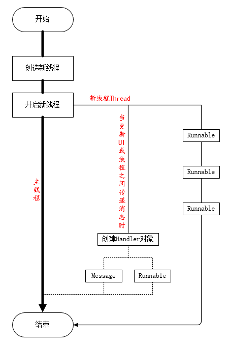

# Android笔记

​				——线程

#### 线程：Handler

##### 流程图：

##### 概念：

###### 进程:

​	进程就是一段程序的执行过程，负责系统资源的分配。

###### 线程:

​	一个进程中可以包含若干个线程，每个线程负责完成一项独立的任务。

###### 多线程:

​	为了同步完成多项任务，不是为了提高运行效率，而是为了提高资源使用效率来提高系统的效率。多线程是在同一时间需要完成多项任务的时候实现的。


##### 名词解释：

###### Thread（线程）:如果插入的代码运行起来卡顿超过5S就会报错，所以要另起线程运行

|  方法   |            说明            |
| :-----: | :------------------------: |
|  run()  | 包含线程运行时所执行的代码 |
| start() |        用于启动线程        |
| sleep() |          线程休眠          |

```java
//新建线程
new Thread(){
            @Override
            public void run() {
                super.run();
                //业务逻辑
                try {
                    Thread.sleep(2000);//线程休眠
                } catch (InterruptedException e) {
                    e.printStackTrace();
                }
            }
        }.start();//线程运行
```


###### Handbler（消息处理器）:接受子线程传过来的Message对象或Runnable对象  ，把这些消息放入主线程队列中，配合主线程进行更新UI

|               方法               |                    说明                    |
| :------------------------------: | :----------------------------------------: |
|          post(Runnable)          |   允许排列一个Runnable对象到主线程队列中   |
|   postDelayed(Runnable ,long)    | 允许定时排列一个Runnable对象到主线程队列中 |
|       sendMessage(Message)       |   允许排列一个Message对象到主线程队列中    |
| sendMessageDelayed(Message,long) | 允许定时排列一个Message对象到主线程队列中  |
|    removeCallbacks(Runnable)     |             关闭定时排列的对象             |
|      sendEmptyMessage(int)       |        只能放数据，处理的时候要判断        |

1.传递消息

```java
new Thread(){
            @Override
            public void run() {
                super.run();
                //创建Handler对象
                Handler handler=new Handler();
                //创建Message对象
                Message msg = new Message();
                //为msg添加数据
                msg.what=1001;
                Bundle bundle = new Bundle();
                bundle.putString("name","小花");
                msg.setData(bundle);
                //将msg添加到handler里
                handler.sendMessage(msg);
            }
        }.start();
```

2.传递代码块

```java
				//创建Handler对象
                Handler handler=new Handler();
                handler.post(new Runnable() {
                    @Override
                    public void run() {
                        //业务操作
                    }
                });
            }
```


###### Runnable（可运行的一段代码）:用在不同的线程里去执行一段代码的接口

例如：

```java
Runnable runnable = new Runnable() { @Override 
	public void run() {
		Log.i(“print”," Runnable "); } 
	} 
};
```


###### Message（消息）:Handler接收与处理的消息对象

1. What:用于接收者(Handler)可以识别这个消息是关于什么的
2. arg1/arg2：这两个参数，如果用户只需要存储几个整数值，相比较于setData（Bundle）setData(),代价更低
3. Bundle data： Message所携带的数据

###### 注：1.不要在UI线程中进行耗时操作

###### 		2.不能在非UI线程中进行UI更新

